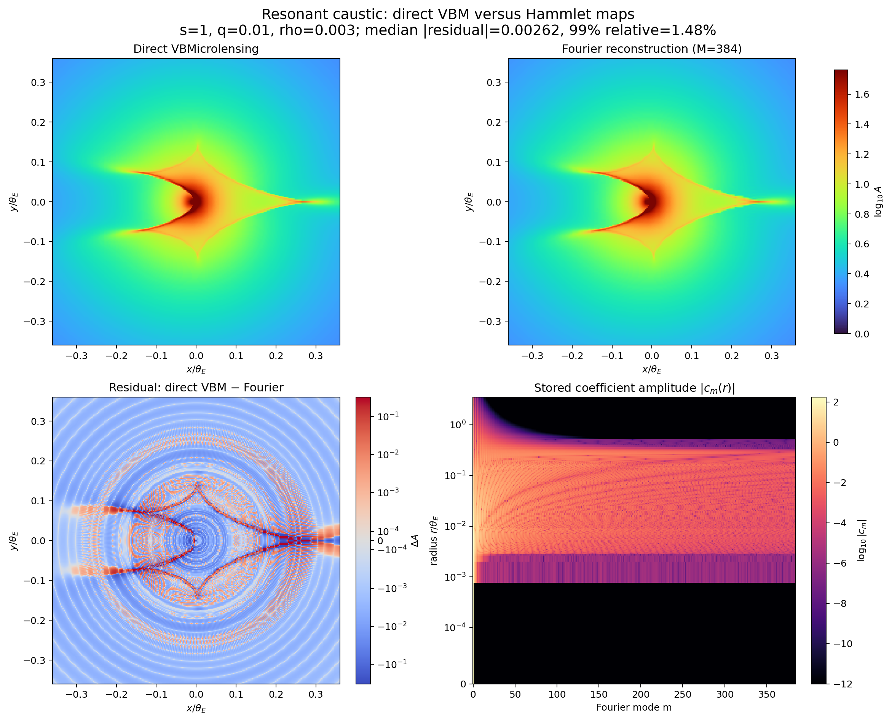

# Hammlet

Hammlet builds reusable Fourier maps for binary-microlensing magnification
patterns and searches them rapidly over `(s, q, rho, alpha)`. It computes the
angular coefficients directly with
[VBMicrolensing](https://github.com/valboz/VBMicrolensing), without first
materializing a large Cartesian AdaMGrid map.

The package is intended to produce accurate **initial seeds** for a downstream
physical fit. It is not a replacement for the final direct-VBM optimization.

## Install

```bash
git clone <repository-url> hammlet
cd hammlet
python -m pip install ".[all]"
```

For generation only, install `.[generate]`; for searching existing maps,
install `.[search]`.

## Build a map in a few lines

```python
from hammlet import MapConfig, ParameterGrid, build_maps

grid = ParameterGrid(
    s=(0.8, 1.0, 1.2),
    q=(1e-4, 3e-4, 1e-3),
    rho=(3e-4, 1e-3),
)
build_maps("maps", grid, config=MapConfig())
```

`MapConfig()` stores through `M=512`. Maps are grouped into `(s,q)` buckets;
each bucket uses the complete rho axis to place 256 radial nodes around measured
spectral difficulty. Angular sampling independently adapts up to 8192 points
near caustics. Every radial interval also receives direct-evaluator holdout
rings used by the stored error certificate. Search reads only the modes needed
by each stage.

The same API accepts logarithmic axes without manual exponentiation:

```python
grid = ParameterGrid.from_log10(
    log_s=[-0.2, 0.0, 0.2],
    log_q=[-4.0, -3.5, -3.0],
    log_rho=[-3.5, -3.0],
)
```

## Search the generated maps

```python
import numpy as np
from hammlet import Maps, Dataset, Geometry

data = np.loadtxt("lightcurve.dat")  # columns: time, flux, flux_error
dataset = Dataset(time=data[:, 0], flux=data[:, 1], error=data[:, 2])

maps = Maps.open("maps")
result = maps.search(
    [dataset],
    [Geometry(t0=2459000.0, u0=0.08, tE=24.0)],
)

best = result.candidates[0]
print(best.s, best.q, best.rho, best.alpha, best.chi2)
print(best.chi2_lower, best.chi2_upper)
```

Multiple observatories are separate `Dataset` objects, so each receives its own
analytically profiled source and blend flux. Multiple nearby `Geometry` seeds
search `(t0,u0,tE)` as one compiled batch. The result defaults to 300 seeds for
the next pipeline stage. The standard path ranks at `M=32`, rescans at `M=128`
with cubic radial interpolation, then refines independent candidates at `M=512`
with JAX-batched pattern and neighbour-map searches.

The FFT-stage `chi2_lower/upper` interval is preserved separately from the
refined coefficient-space chi-square. Refinement never claims to be the final
scientific VBM fit.

## Multi-machine generation

Every map has a deterministic ID in this order:

```text
for s in s_grid:
    for q in q_grid:
        for rho in rho_grid:
            map_id += 1
```

Radial-layout buckets never split a `(s,q)` cell's rho axis. Distributed parts
are contiguous groups of these complete buckets, so every machine can derive
the same adaptive layout independently from the same JSON configuration.

```bash
hammlet build-maps examples/distributed_build.json /shared/hammlet-maps \
  --part-index 0 --part-count 32
```

Submit the same command with indices `0..31`, then merge once:

```bash
hammlet merge-maps /shared/hammlet-maps
```

Completed parts are immutable. A job writes privately and becomes visible only
after an atomic rename. Merge rejects missing parts, grid/config mismatches,
duplicate map IDs, and incompatible coefficient formats. See
[distributed generation](docs/distributed-generation.md) for scheduler
examples and restart behavior.

## Reproducible output

Run:

```bash
python examples/build_and_plot.py
```

It builds a resonant-caustic map, independently evaluates a Cartesian reference
with VBMicrolensing, and compares that reference with the Fourier reconstruction
and its signed residual.



## Documentation

- [Mathematical method and algorithms](docs/theory.md)
- [Python API and configuration](docs/api.md)
- [Distributed generation and maps format](docs/distributed-generation.md)
- [Accuracy certificates and limitations](docs/accuracy.md)
- [Numerical validation plan](docs/validation-plan.md)
- [Development and tests](docs/development.md)

## Scope and important limitations

- The stored certificate is deterministic relative to the two-dimensional
  piecewise-linear reference through adaptive angular samples and nested radial
  holdout rings.
- Angular truncation, radial interpolation, and complex64 storage rounding are
  propagated into the FFT-stage chi-square interval.
- VBMicrolensing variation between unevaluated holdout rings and its own
  internal numerical error are not analytically enclosed. Therefore, the
  interval is not a formal enclosure of continuous direct VBM everywhere.
- Always re-evaluate retained seeds with direct VBMicrolensing before scientific
  inference.

## License

MIT. Please also respect the license and citation requirements of
VBMicrolensing and JAX.
