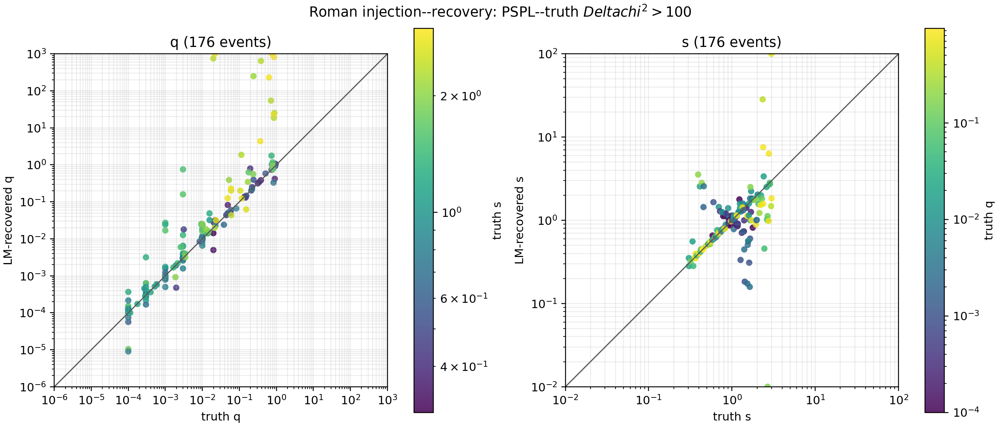

# Roman 200-event coordinate-corrected LM run

This page records the 200-event Roman/GULLS refinement run performed with
the existing read-only packed atlas. No lens maps were regenerated for this
run.

## Input and coordinate contract

The packed snapshot contains 33,903 readable maps out of the 33,993-map
task universe. The missing 90 maps are not needed for this snapshot and were
not waited for. The separate map-retry job was left running independently.

The stored atlas uses the legacy AdaMGrid map frame. GULLS supplies the
physical source trajectory in the native VBMicrolensing frame. For a map with
separation `s` and mass ratio `q`, the direct-VBM refinement therefore uses

```text
shift_x = -(s - 1/s) q/(1 + q),  s > 1
x_map   = x_native - shift_x
y_map   = y_native
```

The shift is zero for `s <= 1`. The source `t0`, `u0`, and `tE` are not
modified; only the coordinates passed to a map-frame evaluator are changed.

## Refinement run

For each event, the best seed from the existing FFT search was refined with
`scipy.optimize.least_squares(method="lm")` and direct VBMicrolensing. Source
and blend fluxes were profiled analytically at every evaluation. The shared
settings were:

| setting | value |
|---|---:|
| events | 200 |
| VBM absolute tolerance | `1e-3` |
| VBM relative tolerance | `1e-4` |
| maximum LM evaluations | 25 |
| finite-difference step | `1e-3` |
| completed worker errors | 0 |

The per-event JSON results and the full summary are kept in the local result
directory used to make the figure. The repository contains the reproducible
refinement and plotting scripts, not the large result tree.

## q and s recovery overview

The figure below includes the 176 events with the independently computed
PSPL--truth `Delta chi^2 > 100`. The axes are logarithmic; recovered `q` is
displayed up to `10^3` and recovered `s` within `10^-2`--`10^2` so that the
bulk of the sample remains readable. Point colors show the complementary
injected parameter: truth `s` in the `q` panel and truth `q` in the `s` panel.



The image sidecar records the exact event selection and plotting limits:
[`roman-lm-q-s-mapcorrected-dchi2gt100.json`](../assets/roman-lm-q-s-mapcorrected-dchi2gt100.json).

## Reproduction

The LM driver can resume an interrupted run and retries only per-event worker
errors. Its SGE wrapper uses the compatibility builds required by the
existing Roman environment:

```bash
python scripts/roman-lm-refine.py \
  --input-root results/roman_local/roman_hammlet_batch100_full_m128_16w1t/events \
  --input-root results/roman_local/roman_binary_hammlet_signal_batch100_full_m128_16w1t/events \
  --output results/roman_local/roman_lm_direct_vbm_batch200_mapcorrected \
  --workers 24 --max-nfev 25 --diff-step 1e-3 --resume
```

The q/s figure is regenerated with:

```bash
python scripts/plot-roman-lm-q-s.py \
  results/roman_local/roman_lm_direct_vbm_batch200_mapcorrected/summary.json \
  --pspl-truth results/roman_local/pspl_truth_dchi2_200_all_points.json \
  --dchi2-min 100 \
  --output assets/roman-lm-q-s-mapcorrected-dchi2gt100.png
```

This is an exact coordinate correction for the direct-VBM refinement stage.
The original shared-radial FFT scan remains a provisional seed search: a
map-dependent translation makes its radial sampling alpha-dependent, so the
old FFT minima should not be described as a globally corrected map search.
